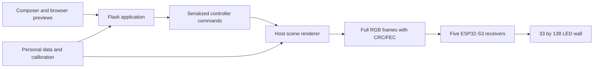

# System architecture

The host composes animations, Widgets, plant effects, palette, pace, and final
presentation into complete RGB frames. The transport divides the frame into
four eight-strip receivers and one single-strip receiver using the calibrated
physical mapping. Receivers decode transport packets and drive their LED lanes.
They boot dark and accept the operator's brightness from the host.

Composer keeps requested scene, controller playback, and receiver connectivity
separate. A request acknowledgement is not proof of exact physical display.
Controller commands remain ordered and correlated so stale replies cannot
replace a newer user selection. Manual takeover supersedes playlist playback.

The web and controller processes share a file-backed command/status channel.
Personal Looks, playlists, custom presets, calibration and settings live outside
the replaceable application directory. Small JSON writes use temporary files and
rename to avoid truncated data. There are no distributed activation transactions,
receiver-native modules, general installation-profile libraries, or automatic
release rollback requirements.

Browser previews remain available while connected. Offline editing is unsupported.
See [validation](CURRENT_COMPOSER_VALIDATION.md) and [deployment](DEPLOYMENT.md).
